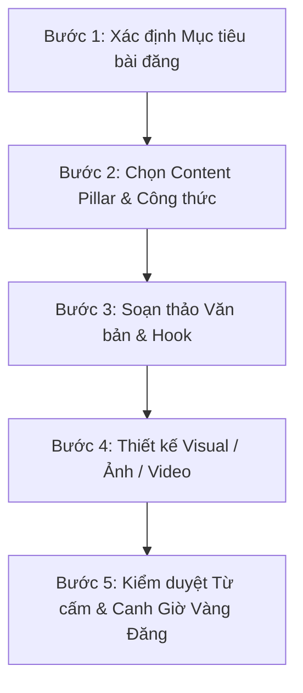

# 🚀 CẨM NANG CÔNG THỨC SẢN XUẤT CONTENT FACEBOOK FANPAGE CHUYÊN SÂU

---

## I. 8 CÔNG THỨC COPYWRITING CHUẨN CHUYỂN ĐỔI CHO FANPAGE

### 1. Công thức AIDA (Attention - Interest - Desire - Action)
*Công thức toàn năng nhất, thích hợp cho bài giới thiệu sản phẩm/dịch vụ mới.*
- **A - Attention (Gây chú ý):** Giật tiêu đề đánh đúng tâm lý/nỗi đau hoặc sự tò mò của khách hàng.
- **I - Interest (Tạo thích thú):** Đưa ra thông tin thú vị, góc nhìn mới hoặc số liệu chứng minh.
- **D - Desire (Khao khát):** Nhấn mạnh lợi ích cốt lõi, giá trị khác biệt giúp cuộc sống khách hàng tốt hơn.
- **A - Action (Hành động):** Đưa ra lời kêu gọi hành động (CTA) ngắn gọn, rõ ràng.

### 2. Công thức PAS (Problem - Agitate - Solve)
*Công thức tập trung vào Nỗi đau (Pain Point) - Đạt tỷ lệ chuyển đổi đơn hàng cao nhất.*
- **P - Problem (Vấn đề):** Nêu rõ bế tắc hoặc khó khăn người đọc đang gặp phải.
- **A - Agitate (Xoáy sâu nỗi đau):** Phóng đại hệ quả nếu không xử lý vấn đề ngay lập tức.
- **S - Solve (Giải pháp):** Giới thiệu sản phẩm/dịch vụ của bạn như "cứu cánh" duy nhất.

### 3. Công thức BAB (Before - After - Bridge)
*Công thức làm nổi bật sự biến đổi - Thích hợp cho bài Review, Case Study & Feedback.*
- **B - Before (Trước đây):** Thực trạng khó khăn, tự tin kém, hiệu quả thấp trước khi dùng sản phẩm.
- **A - After (Sau này):** Bức tranh tươi đẹp, kết quả vượt mong đợi sau khi trải nghiệm.
- **B - Bridge (Cây cầu nối):** Tiết lộ sản phẩm/dịch vụ chính là chiếc cầu giúp đạt được sự thay đổi đó.

### 4. Công thức FAB (Features - Advantages - Benefits)
*Thích hợp cho bài đăng sản phẩm công nghệ, mỹ phẩm, đồ gia dụng có thông số kỹ thuật.*
- **F - Features (Tính năng):** Các đặc điểm nổi bật của sản phẩm (chất liệu, công nghệ, thiết kế).
- **A - Advantages (Ưu điểm):** Điểm vượt trội so với các sản phẩm thông thường trên thị trường.
- **B - Benefits (Lợi ích khách hàng):** Khách hàng nhận được giá trị gì thực tế (tiết kiệm thời gian, đẹp hơn, tiện lợi hơn).

### 5. Công thức 4P (Picture - Promise - Proof - Push)
*Công thức kinh điển cho bài chạy Quảng cáo (FB Ads) & Chốt sale trực tiếp.*
- **Picture (Bức tranh):** Tái hiện viễn cảnh ước mơ của người dùng bằng ngôn từ/hình ảnh sinh động.
- **Promise (Lời hứa):** Cam kết chất lượng hoặc giá trị mà bạn mang lại.
- **Proof (Bằng chứng):** Đưa ra Social Proof (Feedback khách hàng, Chứng nhận, KOC review, Số lượng đã bán).
- **Push (Thúc đẩy):** Tạo sự khan hiếm (Giới hạn 20 suất, Giảm giá 50% chỉ trong hôm nay) + CTA chốt đơn.

### 6. Công thức 3S (Star - Story - Solution)
*Công thức Storytelling truyền cảm hứng - Xây dựng thương hiệu cá nhân & Fanpage Doanh nghiệp.*
- **Star (Nhân vật chính):** Giới thiệu nhân vật (bạn, khách hàng, hoặc một doanh nhân).
- **Story (Câu chuyện):** Kể về hành trình vượt qua thử thách, thất bại và cơ duyên tìm ra lối thoát.
- **Solution (Giải pháp):** Phương pháp hoặc sản phẩm đã rút ra được để chia sẻ tới cộng đồng.

### 7. Công thức PASTOR (Problem - Amplify - Story - Transformation - Offer - Response)
*Dành cho bài viết chuyên sâu dạng Long-form Content hoặc bài giới thiệu Khóa học/Dịch vụ cao cấp.*
- **P - Problem:** Nêu vấn đề.
- **A - Amplify:** Xoáy sâu tác hại.
- **S - Story:** Kể câu chuyện đồng cảm.
- **T - Transformation:** Chứng minh sự thay đổi qua câu chuyện thực tế.
- **O - Offer:** Đưa ra gói giải pháp/ưu đãi hấp dẫn.
- **R - Response:** Kêu gọi hành động và hướng dẫn cách thức đăng ký.

### 8. Công thức SCH (Star - Chain - Hook)
*Tập trung giữ chân người đọc lướt qua Newsfeed.*
- **Star:** Ngôi sao gây chú ý (Hình ảnh cực đẹp hoặc Tiêu đề giật gân).
- **Chain:** Chuỗi lập luận logic chuỗi giá trị thuyết phục từng dòng.
- **Hook:** Móc câu giữ chân và thúc đẩy hành động ở cuối bài.

---

## II. 10 MẪU CẤU TRÚC BÀI ĐĂNG FANPAGE THEO TUYẾN NỘI DUNG (CONTENT PILLARS)

### Mẫu 1: Bài Chia Sẻ Kiến Thức / Giá Trị (Educational Content)
```markdown
[HOOK - TIÊU ĐỀ IN HOA + ICON]
📌 5 SAI LẦM KHIẾN [CHỦ ĐỀ] CỦA BẠN KHÔNG ĐẠT HIỆU QUẢ (MÀ 90% NGUỜI MỚI ĐỀU MẮC PHẢI)

[MỞ ĐẦU - ĐỒNG CẢM & NÊU VẤN ĐỀ]
Bạn đang tốn hàng giờ làm [Chủ đề] nhưng kết quả vẫn là con số 0? Rất có thể bạn đang vướng vào 1 trong 5 tư duy sai lầm dưới đây:

[NỘI DUNG CHÍNH - DẠNG LISTICLE RÕ RÀNG]
🔹 1. [Lỗi sai 1]: ... (Giải thích ngắn 2-3 dòng)
🔹 2. [Lỗi sai 2]: ... 
🔹 3. [Lỗi sai 3]: ... 

[TÓM TẮT & LỜI KHUYÊN]
💡 Lời khuyên: Hãy tập trung vào [Giải pháp cốt lõi] thay vì chạy theo số lượng.

[CTA - KÊU GỌI TƯƠNG TÁC AN TOÀN]
👉 Bạn đang mắc phải lỗi sai số mấy? Để lại comment bên dưới để mình hỗ trợ nhé!
📌 Đừng quên LƯU bài viết này lại để áp dụng ngay hôm nay!
```

---

### Mẫu 2: Bài Bán Hàng Trực Tiếp / Chốt Đơn (Direct Selling Content)
```markdown
[HOOK - ĐÁNH TRÚNG NỖI ĐÂU + GIẢI PHÁP]
💥 TẠM BIỆT [NỖI ĐÂU CỦA KHÁCH HÀNG] CHỈ SAU [THỜI GIAN] VỚI [TÊN SẢN PHẨM]!

[THỰC TRẠNG - XOÁY SÂU NỖI ĐÂU]
Có phải bạn đang mệt mỏi vì:
❌ [Nỗi đau 1: Ví dụ: Da khô lột da mỗi khi mùa đông về]
❌ [Nỗi đau 2: Tốn hàng triệu đồng mua mỹ phẩm nhưng không cải thiện]

[GIỚI THIỆU SẢN PHẨM & LỢI ÍCH NỔI BẬT]
✨ [Tên Sản Phẩm] chính là giải pháp tối ưu dành cho bạn với 3 công dụng đột phá:
1️⃣ [Lợi ích 1]: ...
2️⃣ [Lợi ích 2]: ...
3️⃣ [Lợi ích 3]: ...

[ƯU ĐÃI GIỚI HẠN & BẰNG CHỨNG]
🎁 ĐẶC BIỆT: Tặng ngay [Phần quà] cho 30 khách hàng đầu tiên đặt mua trong hôm nay!
⭐ Hơn 1.000+ khách hàng đã trải nghiệm và đánh giá 5 sao.

[CTA CHỐT ĐƠN]
👉 Nhắn tin ngay cho Fanpage để nhận ƯU ĐÃI 30% & Tư vấn miễn phí!
(Hoặc xem chi tiết tại comment đầu tiên 👇)
```

---

### Mẫu 3: Bài Case Study / Social Proof (Câu Chuyện Khách Hàng Real)
```markdown
[HOOK - CON SỐ ẤN TƯỢNG + KẾT QUẢ]
📈 HÀNH TRÌNH BỨT PHÁ [KẾT QUẢ CON SỐ] CỦA [TÊN KHÁCH HÀNG/ĐỐI TÁC] NHỜ [GIẢI PHÁP]

[BỐI CẢNH BAN ĐẦU - BEFORE]
Khi mới tìm đến [Tên Thương Hiệu], anh/chị [Tên KH] gặp bế tắc lớn:
- [Vấn đề 1]
- [Vấn đề 2]

[QUÁ TRÌNH XỬ LÝ - THE BRIDGE]
Đội ngũ [Tên Thương Hiệu] đã cùng ngồi lại và đưa ra lộ trình 3 bước:
bước 1: Tối ưu lại...
Bước 2: Áp dụng công thức...
Bước 3: Theo dõi sát sao...

[KẾT QUẢ ĐẠT ĐƯỢC - AFTER]
🎯 Và đây là thành quả sau [Thời gian]:
✅ [Con số 1: Tăng 200% doanh thu]
✅ [Con số 2: Tối ưu 50% chi phí]

[BÀI HỌC RÚT RA & CTA]
💡 Bạn cũng muốn đạt được kết quả như [Tên KH]?
👉 Inbox ngay cho [Tên Page] để được phân tích tình trạng miễn phí!
```

---

### Mẫu 4: Bài Bắt Trend / Meme / Giải Trí (Viral & Engagement Content)
```markdown
[HOOK - CÂU NÓI CẢM THÁC / TRENDING STRIP]
🤣 KHI DÂN [NGÀNH NGHỀ] XEM [BỘ PHIM/SỰ KIỆN HOT TREND] VÀ CÁI KẾT...

[NỘI DUNG MÔ TẢ HÀI HƯỚC]
Người bình thường xem: [Góc nhìn thường]
Dân [Ngành nghề] xem: [Góc nhìn hài hước / Lệch pha độc đáo]

[VISUAL CHÍNH]
(Hình ảnh Meme tự chế độc quyền có gắn Logo Fanpage)

[CTA HỎI ĐÁP BÌNH LUẬN]
Tag ngay đứa bạn cùng ngành vào xem có đúng không nào =))
```

---

### Mẫu 5: Bài Q&A / Khảo Sát Ý Kiến (Interactive Content)
```markdown
[HOOK - ĐẶT CÂU HỎI GÂY TRANH CÃI NHẸ / THẢO LUẬN]
🤔 TEAM [LỰA CHỌN A] HAY TEAM [LỰA CHỌN B] - ĐÂU MỚI LÀ CHÂN LÝ?

[BỐI CẢNH TRANH LUẬN]
Có hai luồng ý kiến trái chiều trong giới [Ngành nghề]:
🔹 Phe A cho rằng: [Quan điểm A + Lý do]
🔹 Phe B lại tin rằng: [Quan điểm B + Lý do]

[GÓC NHÌN CỦA FANPAGE]
Góc nhìn của mình: Tùy thuộc vào [Điều kiện X] mà mỗi lựa chọn đều có ưu/nhược điểm riêng.

[CTA KICK-OFF COMMENT]
Anh em thuộc phái nào? Đóng góp góc nhìn bên dưới comment nhé!
```

---

## III. NGUYÊN TẮC THIẾT KẾ CẤU TRÚC BÀI VIẾT TỐI ƯU THỊ GIÁC (VISUAL READABILITY)

1. **Tiêu đề (Hook Layer):**
   - Đặt ở 1-2 dòng đầu tiên.
   - Sử dụng CHỮ IN HOA cho các từ khóa ăn tiền.
   - Kết hợp Emoji phù hợp (🔥, 💥, 📌, 🚀, 💡) để thu hút thị giác người đọc lướt qua.

2. **Đoạn văn ngắn (Paragraph Spacing):**
   - Không viết khối chữ quá 3-4 dòng liên tục.
   - Sử dụng dấu gạch đầu dòng (•, -, 🔹, ✅) để phân tách ý.
   - Thêm khoảng trống (Line Break) giữa các đoạn giúp mắt không bị mỏi khi đọc trên điện thoại.

3. **Lời kêu gọi hành động (Call to Action - CTA Layer):**
   - Luôn có 1 mục tiêu duy nhất cho mỗi bài đăng (Hoặc là Comment, Hoặc là Share, Hoặc là Inbox). Tránh bắt người đọc làm quá nhiều việc cùng lúc.

---

## IV. QUY TRÌNH 5 BƯỚC SẢN XUẤT CONTENT FANPAGE CHUẨN MẪU



1. **Bước 1: Xác định Mục tiêu (Objective):** Bài này để kéo Reach/Follower (Edu/Viral) hay để chốt đơn (Sell/Case Study)?
2. **Bước 2: Chọn Công thức phù hợp:** Chọn AIDA cho sản phẩm mới, PAS cho bài chạy Ads, BAB cho Review...
3. **Bước 3: Soạn thảo dàn ý:** Viết Tiêu đề -> Thân bài -> CTA -> Thêm Hashtag.
4. **Bước 4: Thiết kế Hình ảnh/Video:** Tạo Visual tỉ lệ 4:5 hoặc 1:1 ăn khớp với nội dung text.
5. **Bước 5: Kiểm duyệt & Đăng bài:** Soát bảng từ cấm Facebook + Chọn khung giờ vàng lên bài.
